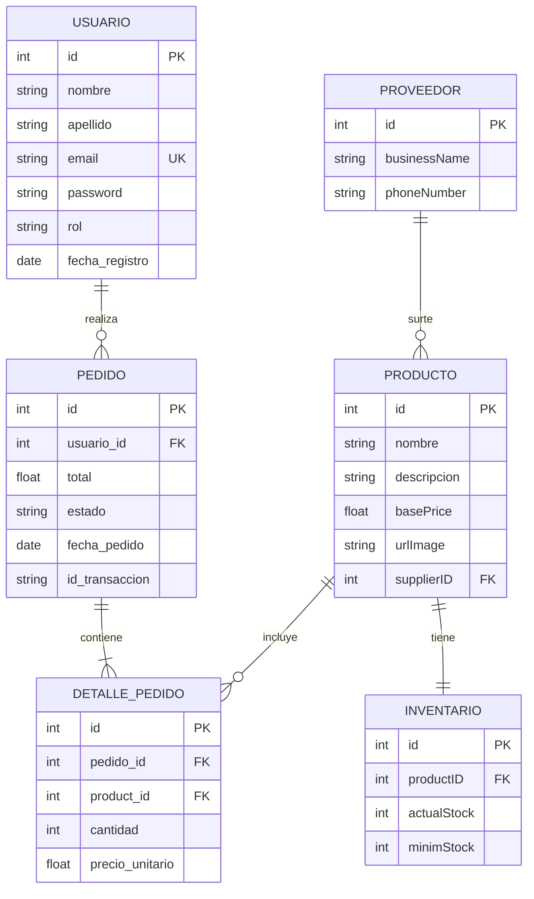
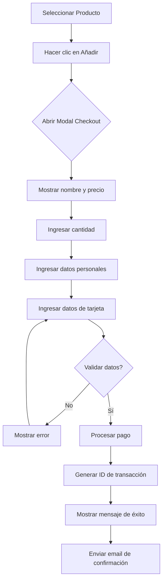
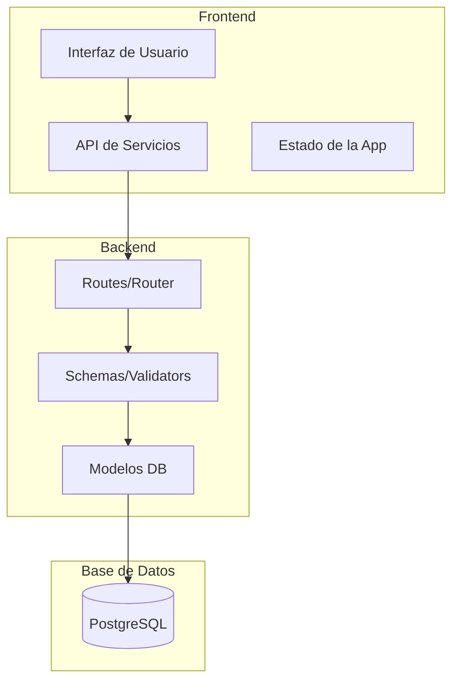

# Diagramas de Diseño - Ecommerce Store

## 1. Diagrama de Casos de Uso

```mermaid
useCaseDiagram
    actor Cliente
    actor Administrador
    actor Vendedor
    
    rectangle "Ecommerce Store" {
        (Ver catálogo de productos)
        (Buscar productos)
        (Filtrar por proveedor)
        (Agregar al carrito)
        (Realizar pago simulado)
        (Registrar usuario)
        (Iniciar sesión)
        (Ver historial de pedidos)
    }
    
    rectangle "Administración" {
        (Gestionar productos)
        (Gestionar inventario)
        (Ver reportes de ventas)
        (Gestionar fornecedores)
        (Registrar pedido para cliente)
        (Ver inventario)
        (Crear promociones)
    }
    
    Cliente --> (Ver catálogo de productos)
    Cliente --> (Buscar productos)
    Cliente --> (Filtrar por proveedor)
    Cliente --> (Agregar al carrito)
    Cliente --> (Realizar pago simulado)
    Cliente --> (Registrar usuario)
    Cliente --> (Iniciar sesión)
    Cliente --> (Ver historial de pedidos)
    
    Administrador --> (Gestionar productos)
    Administrador --> (Gestionar inventario)
    Administrador --> (Ver reportes de ventas)
    Administrador --> (Gestionar fornecedores)
    
    Vendedor --> (Registrar pedido para cliente)
    Vendedor --> (Ver inventario)
    Vendedor --> (Ver reportes de ventas)
    Vendedor --> (Crear promociones)
```

## 2. Borrador de Diagrama Entidad-Relación



## 3. Diagrama de Flujo de Pago



## 4. Diagrama de Arquitectura



---

## Notas

- Las FK indicam claves foráneas
- PK indica clave primaria
- UK indica clave única
- Las relaciones 1:N se representan con ||--o{
- Las cardinalidades están simplified para el alcance inicial